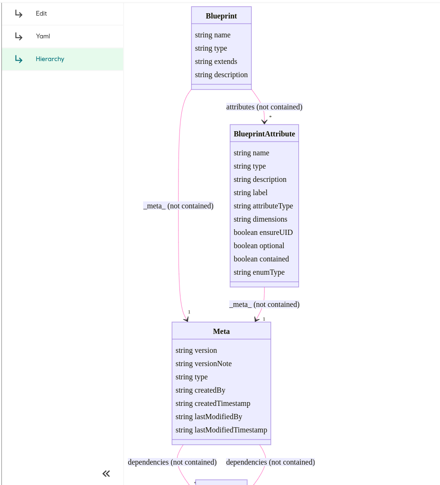

Plugin for displaying relationships between blueprints in a hierarchy.

## Usage

```json
{
  "type": "dmss://system/SIMOS/RecipeLink",
  "_blueprintPath_": "dmss://system/SIMOS/Blueprint",
  "uiRecipes": [
    {
      "name": "Diagram",
      "type": "dmss://system/SIMOS/UiRecipe",
      "plugin": "blueprint-hierarchy"
    }
  ],
```


