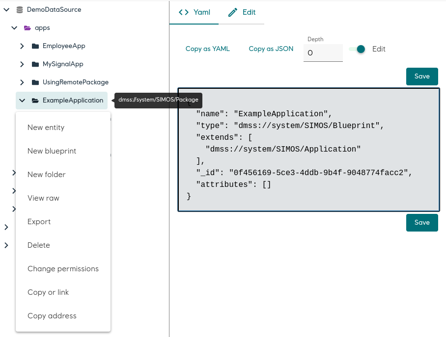

Browse and perform actions on the virtual filesystem in DMSS.


The plugin supports performing different actions on the file tree:

* Create entities
* Create blueprints
* Create folders
* Delete documents
* Change permissions
* Inspect documents and folders
* Get addresses
* Copy or link documents
* Download/Export documents and folders


## Usage

The explorer plugin is a bit special, in that it does not operate on a single entity. Simply set it on any RecipeLink, and it will be available in the UI.

```json
{
  "type": "CORE:RecipeLink",
  "_blueprintPath_": "/apps/ExampleApplication/ExampleApplication",
  "initialUiRecipe": {
    "name": "Explorer",
    "type": "CORE:UiRecipe",
    "plugin": "@development-framework/dm-core-plugins/explorer"
  }
}
```

