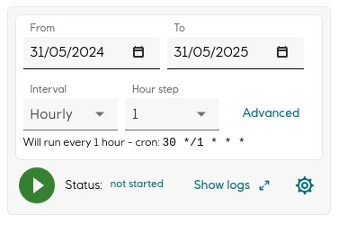

Plugin for `WorkflowDS/Blueprints/Job` and `WorkflowDS/Blueprints/RecurringJob` entities.

Features:

- Start/Stop/Restart/Cancel job
- View job logs
- Select "job runner" from a list of templates
- Configure and register recurring jobs

__Job__


__RecurringJob__


## Usage

Example UiRecipe

``` json
{
  "name": "job-control",
  "type": "CORE:UiRecipe",
  "plugin": "@development-framework/dm-core-plugins/job"
  "config": {
    "type": "PLUGINS:dm-core-plugins/job/ControlConfig",
    "hideLogs": false,
    "runnerTemplates": [
      {
        "type": "PLUGINS:dm-core-plugins/common/Template",
        "label": "Radix",
        "path": "dmss://DemoDataSource/plugins/job/radixJobRunner"
      },
      {
        "type": "PLUGINS:dm-core-plugins/common/Template",
        "label": "Local",
        "path": "~.~.localContainerRunner"
      }
    ]
  },
}
```

`runnerTamplates` is a list of templates that will be shown in the cog-icon dropdown.
The `path` must be an _absolute_ or _relative_ reference to a `runner` entity of the 
type `WorkflowDS/Blueprints/JobHandler`(or extending from it).
