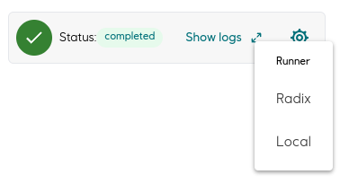

Plugin for creating and controlling entities of type `WorkflowDS/Blueprints/Job` and `WorkflowDS/Blueprints/RecurringJob`.

This plugin can be used on any entity.

Features:

- Start/Stop/Restart/Cancel job
- View job logs
- Select "job runner" from a list of templates
- Configure and register recurring jobs
- Configure job input (recipe config)
- Configure job save location (recipe config

__Job__



__RecurringJob__


## Usage

Example UiRecipe

``` json
{
  "name": "CreateAndRunJob",
  "type": "CORE:UiRecipe",
  "description": "Create and run a job",
  "config": {
    "type": "PLUGINS:dm-core-plugins/job/CreateConfig",
    "jobInputAddress": ".",
    "jobTargetAddress": ".job",
    "jobTemplates": [
      {
        "type": "PLUGINS:dm-core-plugins/common/Template",
        "label": "signal job",
        "path": "/$4483c9b0-d505-46c9-a157-94c79f4d7a6a.study.jobTemplate"
      }
    ],
    "recurring": false
  },
  "plugin": "@development-framework/dm-core-plugins/job/create"
}
```

`runnerTamplates` is a list of templates that will be shown in the cog-icon dropdown.
The `path` must be an _absolute_ or _relative_ reference to a `runner` entity of the 
type `WorkflowDS/Blueprints/JobHandler`(or extending from it).
