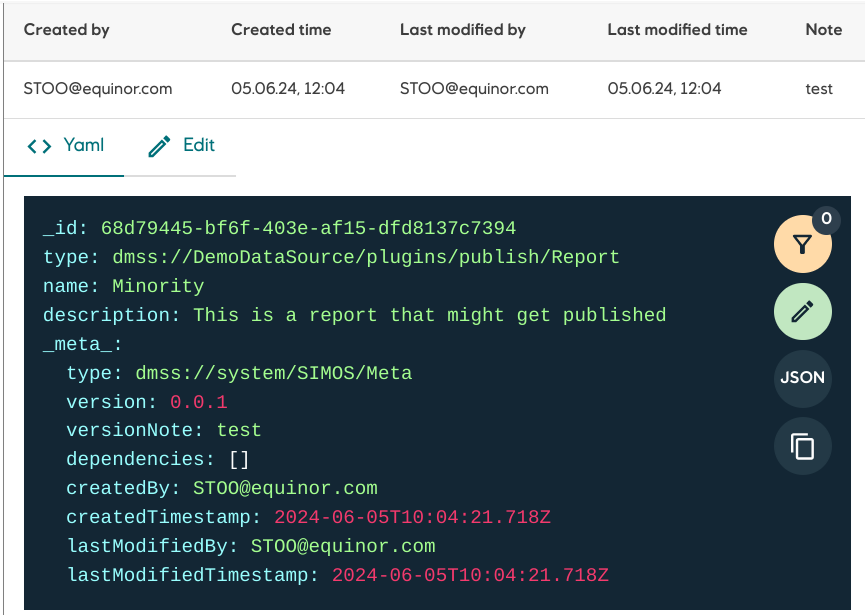

Plugin for displaying the `_meta_`-attribute of any entity. The entity it self will be displayed right under the meta-information.



## Usage

```json
{
    "type": "CORE:UiRecipe",
    "name": "Meta",
    "plugin": "@development-framework/dm-core-plugins/meta"
}
```
The plugin can be used on any type of entity, and has no configuration.