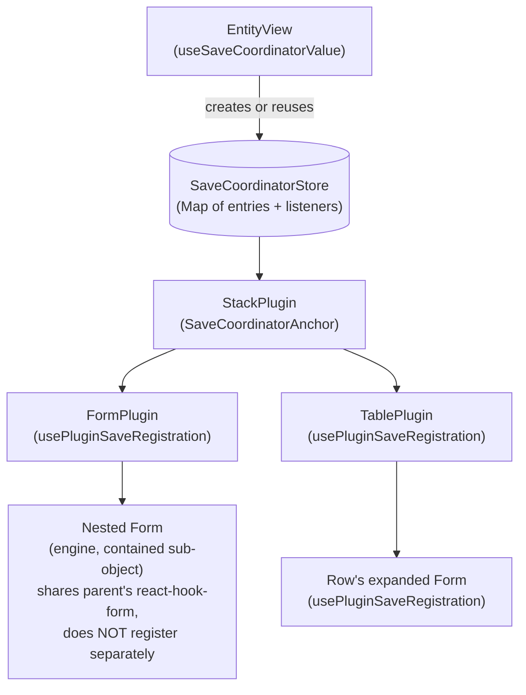
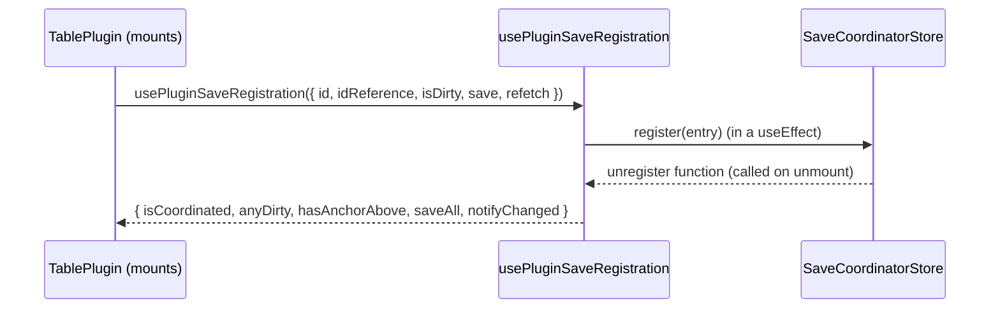
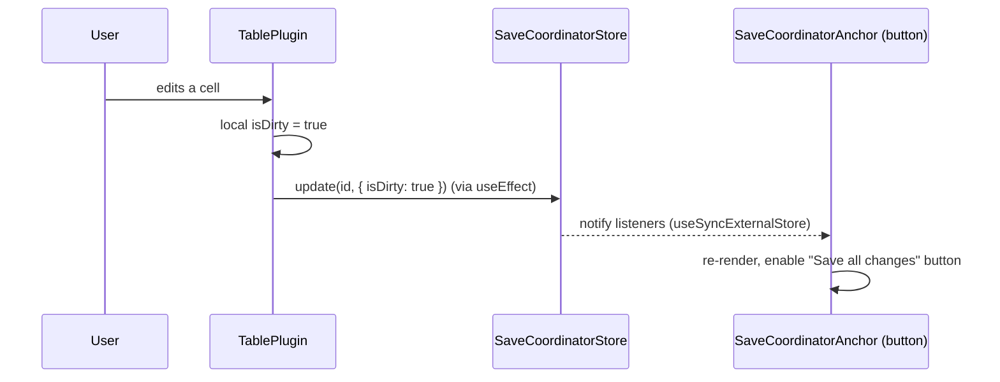
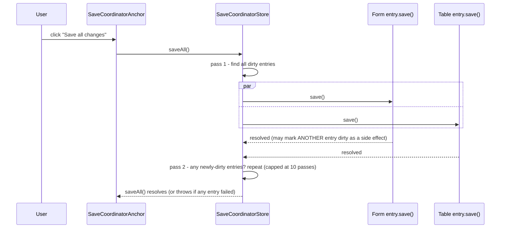
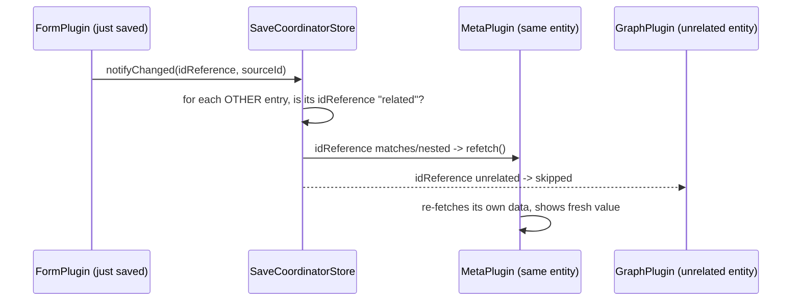
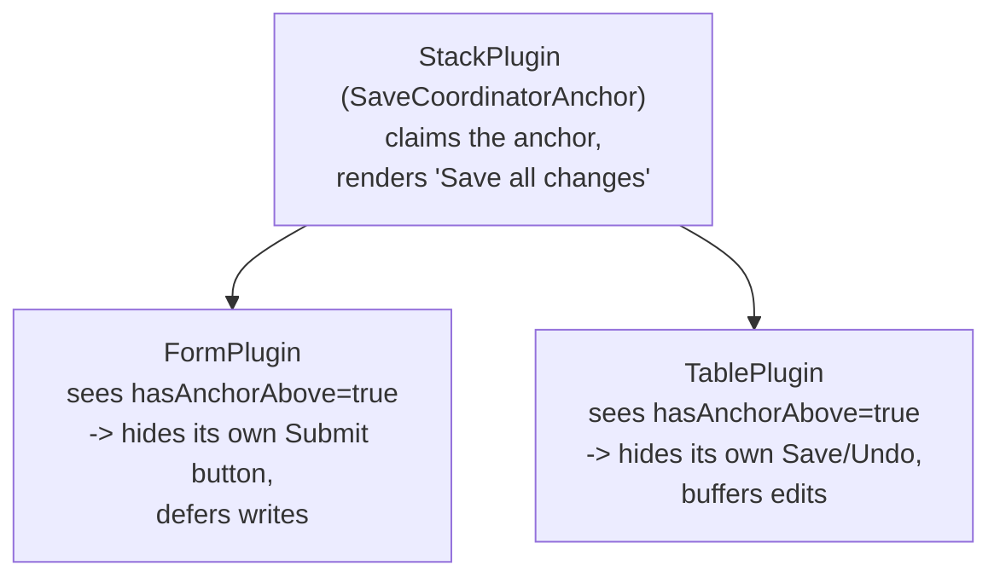
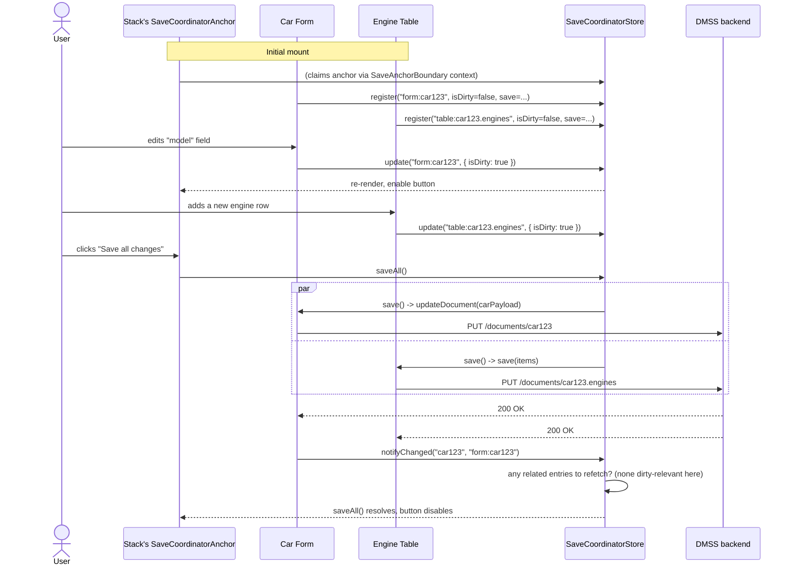

# SaveCoordinator & SaveAnchor — Architecture & Usage Guide

This document explains how the SaveCoordinator system works end-to-end — the
problem it solves, how data flows through it, and how to use it when building
applications on top of `dm-core` / `dm-core-plugins` (e.g. SIMOS-based apps).

For the terse, code-adjacent reference aimed at framework maintainers, see the
sibling file `SaveCoordinator.README.md` in this same folder. This document is
the onboarding/architecture version, aimed at people building **applications**
on top of the framework, not modifying the framework itself.

> To turn this into a PDF: open this file's Markdown preview in VS Code and
> use "Print" → "Save as PDF", or install the "Markdown PDF" extension and run
> "Markdown PDF: Export (pdf)" against this file.

---

## 1. The problem it solves

An application built on this framework is assembled from independent
**plugins** — `Form`, `Table`, `List`, `Graph`, `Stack`, `Tabs`, `Sidebar`, and
so on. Each plugin is deliberately self-contained: it fetches its own data and
knows nothing about its siblings or ancestors. That isolation is good for
plugin authors, but it creates two very visible problems for end users once
several plugins are composed together to represent *one logical entity*:

1. **Too many save buttons.** If a `Table` is nested inside a `Form` (e.g. a
   Car with a list of parts), and both save independently, the user sees two
   competing "Save" actions for what they perceive as a single thing they're
   editing.
2. **Stale sibling data.** If editing a `Form` changes something a nearby
   `Graph` or `Meta` panel is displaying, that other plugin has no way to
   know it should refresh — the user has to manually reload.

SaveCoordinator solves both, without requiring plugins to know about each
other directly.

---

## 2. The two mechanisms, at a glance

| Mechanism | What it answers | Implementation |
|---|---|---|
| **SaveCoordinator store** | "What's dirty? What can be saved? Save everything." | Plain pub/sub `Map`, shared via React Context, read with `useSyncExternalStore` |
| **SaveAnchor** | "Has something above me already claimed responsibility for the Save button?" | Plain React Context boolean (`true`/`false`) |

These look similar but are solved with **deliberately different tools** — see
[§6](#6-why-two-different-mechanisms) for why that distinction actually
matters and isn't accidental.

---

## 3. Data flow

### 3.1 Store scoping — one store per rendered entity tree



Every `EntityView` calls `useSaveCoordinatorValue()`. That either **reuses**
an ancestor's store (found via context) or **lazily creates a brand-new one**
if none exists yet. The practical effect: everything rendered underneath one
top-level `EntityView` — no matter how many plugins deep — shares exactly
**one** store. Plugins used completely standalone (no `EntityView` ancestor
at all) see no store, and every hook safely no-ops in that case.

### 3.2 Registration — a plugin joins the coordinator



`id` must be unique per plugin *instance* (convention: `"<plugin>:<idReference>"`).
`idReference` is the address the plugin's data lives at — used later to work
out which other entries are "related" for refresh purposes.

### 3.3 Editing — dirty state propagates without full re-renders



Because the store is a plain pub/sub structure (not React state), registering
a plugin or flipping its dirty flag — which can happen on every keystroke —
**never re-renders the whole plugin tree**. Only components actually
subscribed via `useSyncExternalStore` (the anchor button, or another entry
checking `anyDirty`) re-render, and only when the specific value they read
actually changes.

### 3.4 Saving — one click flushes every dirty entry, in dependency-safe passes



A single pass isn't always enough: one entry's `save()` can, as a side
effect, mark a *different* entry dirty (e.g. a row-level Form's save flows
into its parent Table's local state via `updateItem(..., false)`). That
newly-dirtied entry wouldn't exist in a snapshot taken before the pass
started, so `saveAll()` keeps sweeping for newly-dirty entries until a pass
finds none left (capped at 10 passes, with a console warning if the cap is
hit — a sign something never clears its own dirty flag).

**Important existing gotcha (already fixed once, worth knowing about if you
extend this):** a nested editor's `save()` resolving doesn't guarantee its
parent's `isDirty` has reached the store yet — that normally happens via a
`useEffect` after React re-renders, which is *not* guaranteed to land before
`saveAll()`'s very next pass. If you wire a new plugin with a "nested editor
writes into a parent's local state" pattern, push `isDirty: true` into the
store **synchronously**, at the exact point that local state changes —
don't rely solely on the `isDirty` you pass into `usePluginSaveRegistration`.

### 3.5 Reactivity — related plugins refresh automatically



Two addresses are "related" if they're identical, or one is a nested
attribute/array-item of the other (`a.startsWith(b + '.')`, etc.). This means
saving a Car correctly refreshes a `Meta` panel showing that same Car, or a
`Table` row's expanded editor refreshing its own parent Table row — but it
only reaches plugins that are **currently mounted** (an inactive `Tabs`/
`Sidebar` tab has already unregistered and can't be notified) and only
covers changes made *through this same coordinated tree* (a change from
another browser tab, or a backend job, is invisible to it).

---

## 4. The anchor problem — who shows the Save button?

You cannot decide "should I show my own Save button?" from **tree position**
alone — almost every plugin has *some* `EntityView` ancestor, so "do I have
an ancestor" tells you nothing. Instead, a plugin only hides its own controls
if an ancestor has **explicitly claimed** the anchor:



`FormPlugin` wraps its own output in `<SaveAnchorBoundary>` whenever it owns
its own submit lifecycle (i.e. it's not itself nested/sharing an ancestor's
form). Any plugin nested underneath then sees `hasAnchorAbove: true` via
`useHasSaveAnchor()` (exposed as part of `usePluginSaveRegistration`'s return
value) and can hide its own controls, trusting the ancestor's `saveAll()` to
flush its writes later instead.

For pure layout/container plugins with **no save UI of their own** — `Stack`,
`Grid`, `ResponsiveGrid`, `Tabs`, `Sidebar`, `SingleView` — there's a
ready-made component:

```tsx
import { SaveCoordinatorAnchor } from '@development-framework/dm-core'

<SaveCoordinatorAnchor label="Save all changes">
  {/* nested plugins automatically see hasAnchorAbove: true */}
</SaveCoordinatorAnchor>
```

It's safe to nest multiple of these — it renders children completely
unchanged (no button, no new claim) if there's no coordinator at all, or if
an ancestor has *already* claimed the anchor. Only the outermost one actually
does anything. It also shows **no button at all** if nothing inside the
subtree is even capable of being saved (e.g. a `Stack` of purely read-only
plugins like `Graph`) — avoiding a permanently-disabled, useless button.

---

## 5. Sequence: a complete end-to-end example

Concretely, for a page showing a Car inside a `Stack`, with a `Table` of
Engines nested inside:



---

## 6. Why two different mechanisms

It's tempting to think "dirty state" and "who owns the anchor" are the same
kind of problem and should use the same tool. They deliberately don't:

- **Dirty-state / save / refetch registration** uses the pub/sub store +
  `useSyncExternalStore`, specifically to *avoid* re-rendering the whole tree
  on every keystroke — there can be many entries, and updates are frequent.
- **Anchor claiming** uses a plain React Context `Provider`, specifically
  *because* claims are rare and roughly static for a component's lifetime,
  and — critically — need to be visible to descendants **during their very
  first render**.

The reason for that last point: React fires `useEffect` callbacks
**child-before-parent** on mount. If anchor-claiming were done imperatively
inside an effect (the same way plugin registration works), a nested `Table`'s
own registration effect would fire *before* its ancestor `Form`'s
anchor-claiming effect — the Table would check "has an anchor been claimed?",
see `false`, and briefly render its own Save button before flipping to the
deferred state on the next re-render. That's a real, visible flash of
incorrect UI. Plain Context sidesteps this entirely: context values are
available to descendants synchronously during their first render, no effect
ordering involved.

If you're extending this system, keep that constraint in mind — anything
based on effects firing in a particular order is fragile by construction,
for exactly this reason.

---

## 7. How to use this when building an application

### 7.1 If you're only composing existing plugins (the common case)

You usually don't need to touch this API directly at all. Just nest plugins
normally in your recipes — `Stack`/`Grid`/`Tabs`/`Sidebar`/`SingleView`
already claim the anchor automatically, and `Form`/`Table`/`List`/`DataGrid`/
`Blueprint`/`Yaml` already register themselves and defer correctly when
nested. A recipe like:

```json
{
  "type": "PLUGINS:dm-core-plugins/stack/StackPluginConfig",
  "items": [
    { "recipe": "carDetails" },
    { "recipe": "carEngineTable" }
  ]
}
```

will automatically show **one** "Save all changes" button covering both the
Form and the Table beneath it — no extra configuration needed.

### 7.2 If you're writing a new leaf plugin (owns real, persistable data)

Register once, near where you already manage local dirty state / fetching:

```tsx
const { hasAnchorAbove, saveAll, notifyChanged } = usePluginSaveRegistration({
  id: `myPlugin:${idReference}`,
  idReference,
  isDirty: myLocalDirtyState,
  save: () => myOwnPersistFunction(),
  // Never pass a bare useState setter here directly - see gotcha below.
  refetch: () => reloadMyOwnData({}),
})

// Hide your own Save/Cancel UI when something above already owns it:
{!hasAnchorAbove && <MyOwnSaveButton onClick={...} />}
```

**Gotchas to know before wiring a new plugin:**
- Never pass a bare state setter (like `useList`'s `reloadData`) directly as
  `refetch`. It's invoked with **no arguments** - `setter(undefined)` is a
  no-op if state is already `undefined`, and React silently skips
  re-rendering. Always wrap it: `refetch: () => reloadData({})`.
- If your plugin can be nested such that a *child* editor writes back into
  *your* local state (the "Table row → expanded Form" pattern), push
  `isDirty: true` synchronously into the coordinator store at the exact point
  that local state changes - don't rely purely on the `isDirty` value you
  pass into the hook, since a state update after an async resolution isn't
  guaranteed to land before the coordinator's very next save pass.
- If your plugin never persists anything (e.g. a read-only `Graph`), still
  register (for `refetch`/reactivity), but omit `save` entirely — this
  correctly keeps you out of `hasSavableEntries()`/`saveAll()`.

### 7.3 If you're writing a new pure layout/container plugin

If it has no save UI of its own, just wrap your rendered output:

```tsx
import { SaveCoordinatorAnchor } from '@development-framework/dm-core'

return <SaveCoordinatorAnchor>{yourRenderedChildren}</SaveCoordinatorAnchor>
```

That's the entire integration - it's always safe, even if nested inside
another anchor-claiming container, or used with no coordinator at all.

### 7.4 If you're writing a Form-plugin-like thing that can be nested inline

This is the subtlest case (see the Engine/Car investigation this system was
hardened against). If your plugin can render as a **contained sub-object**
sharing an ancestor `Form`'s live `react-hook-form` instance (i.e. it's given
an `onChange` prop instead of `onSubmit`), it must **not** independently
register a coordinator entry or wire its own submit-to-its-own-address -
`handleSubmit()` on a shared instance submits the *entire* ancestor form, not
just your slice. Detect this mode (`!!props.onChange`) and skip your own
coordinator registration's `isDirty`/`save` entirely in that case, letting
the true ancestor own saving completely.

---

## 8. Current wiring status (framework-provided plugins)

| Category | Plugins | Behavior |
|---|---|---|
| Read-write leaves | `Table`, `Form`, `List`, `DataGrid`, `Blueprint` | Register `isDirty`+`save`+`refetch`; hide own save UI when `hasAnchorAbove` |
| Read-write leaf (special case) | `Yaml` | Registers fully, but **keeps** its own Save/Cancel UI even when `hasAnchorAbove` (uncontrolled contentEditable, no other exit path) |
| Read-only leaves | `Graph`, `Json`, `Markdown`, `Meta`, `BlueprintHierarchy`, `MediaViewer` | Register `refetch` only |
| Special-case leaf | `File` | Uploads persist immediately; registers `refetch` + calls `notifyChanged()` after upload |
| Anchor-providing containers | `Stack`, `Grid`, `ResponsiveGrid`, `Tabs`, `Sidebar`, `SingleView` | Wrap children in `SaveCoordinatorAnchor` |
| Transparent passthroughs | `RoleFilter`, `Header`, `Explorer` | No coordinator involvement, but don't block it either |
| Deliberately unwired | `JobCreate`, `JobControl`, `Publish` | Their "unsaved" state isn't a document edit - sweeping them into `saveAll()` would be semantically wrong |

## 9. Known limitations (be aware, not necessarily blockers)

- **Same-pass races**: two entries writing to overlapping addresses within
  the *same* `saveAll()` pass can still race with each other (`Promise.allSettled`
  runs a pass in parallel) - the multi-pass loop only serializes *across*
  passes, not within one.
- **Unmounted plugins can't be notified**: a `Meta` panel behind an inactive
  `Tabs`/`Sidebar` tab has already unregistered, so it won't refresh even if
  related data changed - it'll show fresh data next time it mounts.
- **No cross-tab/cross-session reactivity**: a change from another browser
  tab or a backend job doesn't trigger any `refetch()` - `useList` currently
  bypasses react-query's cache entirely, so this would require a separate,
  larger migration.

---

## 10. Quick reference

```tsx
// Leaf plugin that owns data:
usePluginSaveRegistration({ id, idReference, isDirty, save, refetch })
  // -> { isCoordinated, anyDirty, hasAnchorAbove, saveAll, notifyChanged }

// Pure layout/container plugin:
<SaveCoordinatorAnchor label="Save all changes">{children}</SaveCoordinatorAnchor>

// Checking anchor status without full registration:
useHasSaveAnchor()  // -> boolean

// Manually claiming the anchor (rarely needed directly):
<SaveAnchorBoundary>{children}</SaveAnchorBoundary>
```
